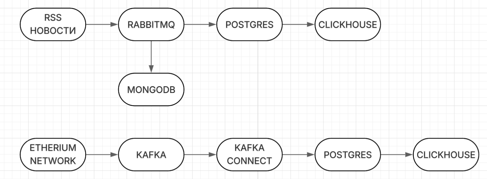

# Сборщик крипто данных

## Обзор проекта

Данный проект использует Apache Airflow для управления workflow, собирает данные транзакций Ethereum и RSS-лент новостей, обрабатывает их и отправляет в разные системы хранения и анализа данных, такие как Kafka, MongoDB, ClickHouse и т.д.

## Установка и настройка

1. **Клонирование репозитория**: 
   ```bash
   git clone https://github.com/NickLuck777/New_crypto.git
   ```

2. **Запуск Docker compose**: 
Убедитесь, что Docker установлен на вашем компьютере. Затем выполните команду:

   ```bash
   cd New_crypto
   docker compose up -d --build
   ```

P.S. airflow-custom образ создается долго (PyTorch тяжелый). Пожалуйста, подождите.

## Системная архитектура



##  Описание дагов Airflow

Проект включает несколько Airflow DAGs для разных задач обработки данных:

1. **GET_ETH_DAG**: Запускается каждую минуту для сбора данных транзакций Ethereum и отправки их в Kafka.
2. **RSS_DAG**: Запускается каждые 15 минут для сбора новостей из RSS-лент, анализа настроения и хранения результатов в PostgreSQL и MongoDB.
3. **DATA_MOVER_DAG**: Запускается ежедневную задачу, которая перемещает данные из PostgreSQL в ClickHouse для аналитических целей и выполняет очистку обработанных данных для поддержания производительности базы данных.

## Мониторинг

Проект включает в себя комплексную систему мониторинга:

- **Prometheus**: Собирает метрики из всех сервисов
- **Grafana**: Предоставляет дашборды, организованные по тегам:
  - Kafka dashboards для мониторинга пропускной способности и здоровья брокера
  - PostgreSQL dashboards для метрик производительности базы данных
  - ETH dashboards для анализа транзакций блокчейна


3. **Доступ к Airflow UI**: 
После запуска контейнеров доступ к Airflow UI осуществляется по адресу `http://localhost:8080`. 
Пользовательские данные: username: `airflow`, password: `airflow`.

4. **Конфигурация переменных и подключений Airflow**: 
Переменные и подключения Airflow уже настроены в файлах `connections.json` и `variables.json` и импортированы при запуске.

5. **Запуск Airflow DAGs**: 
RSS_DAG и GET_ETH_DAG будут запущены автоматически при запуске. 
DATA_MOVER_DAG запланирован на ежедневное выполнение в 00:00, но для просмотра результата работы этого дага нужно его запустить вручную.

6. **Проверка результатов**

Для проверки результатов работы дагов можно использовать дашборды Grafana или проверить таблицы в базах данных MongoDB,Postgres, Clickhouse.
Доступ к Grafana осуществляется по адресу http://localhost:3000/dashboards
Пользовательские данные: username: `admin`, password: `admin`.

Доступ к Prometheus осуществляется по адресу http://localhost:9090

## Использование

- **Сбор данных транзакций Ethereum**: 
Скрипт `get_eth_data.py` подключается к узлу Ethereum через API Alchemy, получает последние транзакции блоков и отправляет их в Kafka. Kafka Connect передает данные в PostgreSQL.

- **Обработка новостей RSS**: 
The `RSS_DAG.py` DAG периодически получает новости из настроенных RSS-лент, анализирует настроение с помощью transformers-модели, трансформирует данные и сохраняет их в MongoDB и PostgreSQL.

- **Перемещение данных**: 
The `DATA_MOVER_DAG.py` DAG перемещает данные из PostgreSQL в ClickHouse для аналитических целей и выполняет очистку обработанных данных для поддержания производительности базы данных.

## Дашборды Grafana

Проект включает несколько дашбордов Grafana для мониторинга и анализа, организованных по тегам:

### ETH дашборды
- **Common network activity**: Отображает метрики сети Ethereum, такие как среднее время блока и количество транзакций
- **Blob-transactions monitoring**: Фокусируется на транзакциях EIP-4844 blob
- **Gas and transactions price analysis**: Анализирует цены газа и стоимость транзакций
- **User behavior and smart-contracts analysis**: Исследует взаимодействие пользователей с смарт-контрактами
- **Pipeline health check**: Мониторит общее здоровье данных

### Kafka дашборды
- **Kafka Exporter Overview**: Мониторит здоровье брокера Kafka, пропускную способность и группы потребителей

### PostgreSQL дашборды
- **PostgreSQL Exporter**: Предоставляет подробные метрики о производительности базы данных
- **News sentiment**: Анализирует тенденции в настроении новостей криптовалют

